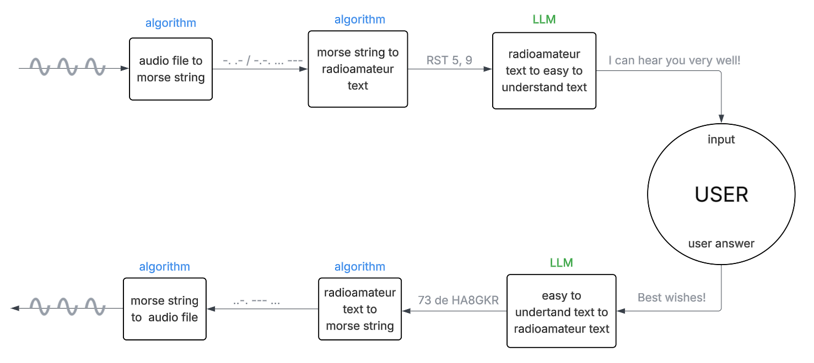

# BeepBoopChat

This repository serves as the semester project for the Prompt Engineering (BMEVITMAV82) course at the Department of Telecommunications and Artificial Intelligence, Budapest University of Technology and Economics.

## Application Flowchart



## Installation

To install the required dependencies, run the following command:

```bash
pip install -r requirements.txt
```

## Running the Application

To run the application, execute the following command:

```bash
python main.py
```

© 2025 Gábor Kreinicker and Zsolt Szász